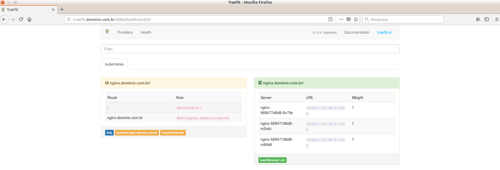
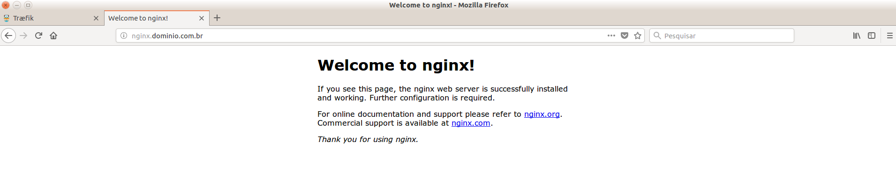

# Configurando o Treafik no Cluster Kubernetes

### Cenário:

* 1 Kubernetes Master 1.8.5
* 1 Kubernetes Node 1.8.5

### Clone do projeto

    git clone https://github.com/vandocouto/kubernetes-traefik.git

### Deploy Traefik

Passo 1 - Criando o RBAC, para liberar o Traefik a consultar API do Kubernetes.

RBAC - Controle de Acesso Baseado em Função, que tem como função liberar/autorizar consultas a API do Kubernetes (rbac.authorization.k8s.io/v1).

OBS: Para habilitar o RBAC, inicie o apiserver com --authorization-mode=RBAC.

Mais detalhes em: https://kubernetes.io/docs/admin/authorization/rbac/

    cd traefik
    kubectl apply -f traefik-rbac.yml
    
Passo 2 - Implementando o Traefik utlizando o DaemonSet

É possível utilizar o Traefik de duas maneiras: 

* Deployment
    * A escalabilidade é muito melhor ao utlizar, no DeamonSet o modelo utilizado é Single-Pod-Node.

* DaemonSet
    * Com ele é possível executar exclusivamente um Serviço em um conjunto dedicado de máquinas.
    * Por outro lado, o DaemonSet permite que você acesse qualquer Nó diretamente.
    

    
<pre>kubectl apply -f traefik-ds.yaml</pre>
    
 
### Deploy Nginx 
 
 Passo 1 - Acessando o diretório nginx
 
    cd ../nginx

Passo 2 - Criando o Deployment

    kubectl apply -f nginx-deployment.yml 

Passo 3 - Criando o service 
  
    kubectl apply -f nginx-service.yml    
    
Passo 4 - Criando o ingress
    
    kubectl apply -f nginx-ingress.yml 
    
### Ajustando o Host/Gmask

Passo 1 - Pegue o ip do Node 

    kubectl get node
    NAME              STATUS    ROLES     AGE       VERSION
    10.3.2.44   Ready     master    3d        v1.8.5
    10.3.2.45   Ready     node      5h        v1.8.5

Passo 2 - Configure o IP

    10.3.2.45 nginx.dominio.com.br traefik.dominio.com.br
    
Passo 3 - Acesse o Traefik pelo navegador 

Passo 4 - Acesse o Nginx pelo navegador

